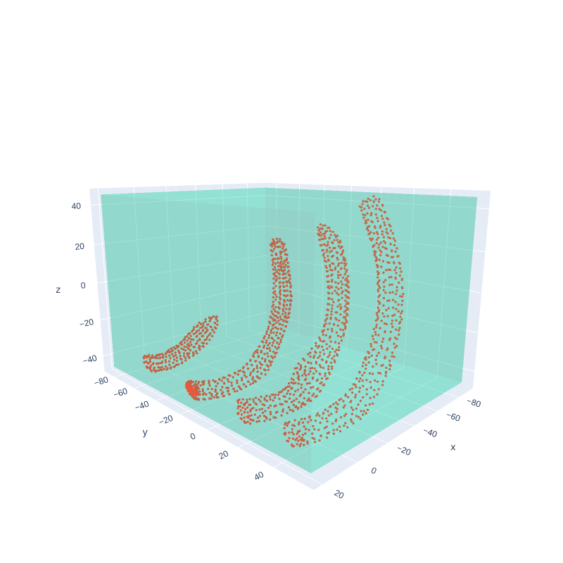
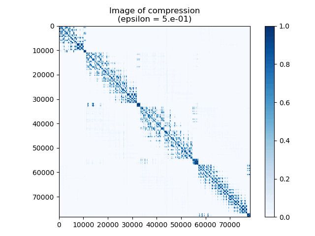
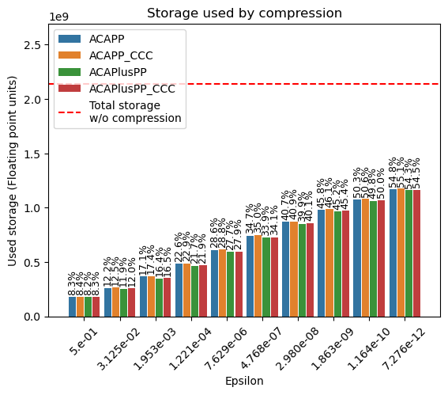
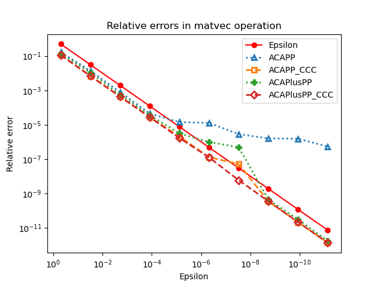

# MyHM 

[IN DEVELOPMENT]

Custom hierarchical matrix (H-matrix) compression method made in Python and accelerated with Numba.

This code is part of my Master's work at the Pontificia Universidad Católica de Chile with Professor Elwin van 't Wout. The main objective is to apply H-matrix compression in High Intensity Focused Ultrasound (HIFU) contexts, where the generated matrices are so large that memory is a major limitation to perform simulations relevant to a realistic biomedical context. We seek to implement efficient compressions of these matrices and apply them to simulations of homogeneous and heterogeneous materials, comparing the results and studying the behaviour of the ultrasound focus. For the simulations with homogeneous materials, the Boundary Element Method (BEM) was used as the numerical method and the kernels used for the partial matrix assembly were created with the Python library Bempp-cl ([Bempp-cl](https://github.com/bempp/bempp-cl/tree/main)). On the other hand, the simulations with heterogeneous densities were calculated with a method involving volume and surface integral equations, and the kernels implemented for the partial assembly were built with research work of Danilo Aballay ([GitHub Profile](https://github.com/daniloaballayf), research partner under the same professor).

The entire repository is under development and is updated on a regular basis.

  

Example of application of hierarchical matrices on ribs

  

Representative image of the compression ratios of a dense BEM matrix for different epsilon values

  
  

Example of storage results and relative compression errors for different epsilon values.

It should be noted that the relative errors image is related to a study of the behaviour of four different versions of the Adaptive Cross Approximation (ACA) algorithm with respect to early convergence problems in double layer operators for simulations with heterogeneous materials.

## Dependencies:

    Numpy
    Bempp-cl
    Scipy
    Numba
    Pandas
    Matplotlib
    Seaborn
    Plotly
